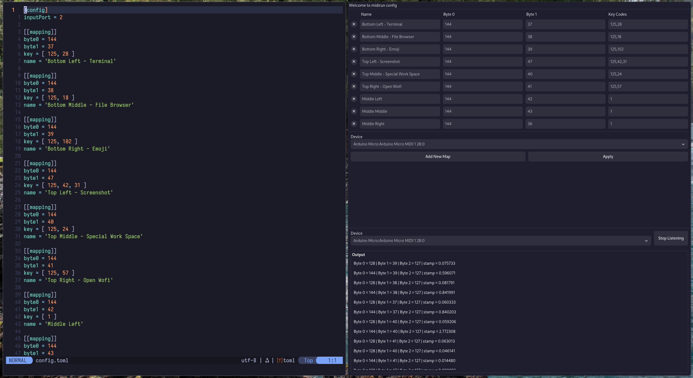

# Midirun Config

**v0.1.2-beta**
_TOML configuration genorator for [Midirun](https://github.com/JackMechem/MidiRun)_



### :sparkles: Features

- Console for listening to midi outputs and displaying midi data
- Interface for creating/removing mappings
- Listen for key presses and return keycode
- Config generation

### :battery: Requirements

- [midirun](https://github.com/JackMechem/MidiRun)
- [rtmidi](https://github.com/thestk/rtmidi)
- [gtkmm-4.0](https://gtkmm.gnome.org/en/index.html)
- [toml++](https://marzer.github.io/tomlplusplus/)
- [libevdev](https://www.freedesktop.org/wiki/Software/libevdev/)
- [libudev](https://www.freedesktop.org/software/systemd/man/latest/libudev.html) (will migrate to sd-device soon)

### :arrow_up: Installation

##### Arch

```
yay -S midirun-config

# Logout and login to apply user group
usermod -aG input $USER
```

### :electric_plug: Manual Installation

#### 1. Install Dependencies

##### Arch

```bash
sudo pacman -S rtmidi gtkmm-4.0 tomlplusplus libevdev
```

##### Debian

```bash
sudo apt update
sudo apt install librtmidi-dev libgtkmm-4.0-dev libtomlplusplus-dev libevdev-dev
```

##### Fedora

```bash
sudo dnf install rtmidi-devel gtkmm40-devel tomlplusplus-devel libevdev-devel
```

##### openSUSE

```bash
sudo zypper install rtmidi-devel gtkmm4-devel tomlplusplus-devel libevdev-devel
```

#### 2. Clone and Compile

```bash
# Clone and cd
git clone https://github.com/JackMechem/midirun-config.git
cd midirun-config

# Compile and Install
meson setup build
meson compile -C build
meson install -C build
```

#### 3. Add udev rule and add user to `input` group

###### :warning: Optional. If Midirun Config doesn't have permissions to `/dev/input/event*`, keycodes will have to be provided manually (finding keycodes can be done with `sudo showkey --keycode`).

Midirun Config needs to access `/dev/input/event*`, a udev rule can be created to give this access to users in the `input` group

```
# Creates udev rule file and reload udev rules
sudo ./create_udev_rule.sh

# Add user to input group (logout and login to apply)
sudo usermod -aG input your_username
```
